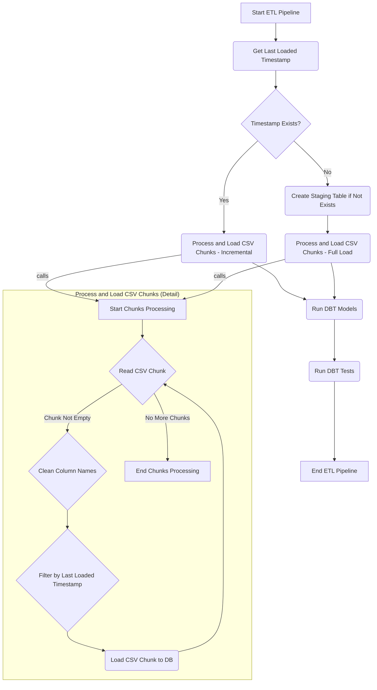

# Fire Incidents Data Warehouse ETL and Modeling

This project implements an Extract, Load, and Transform (ELT) pipeline to load fire incident data into a PostgreSQL data warehouse and model it using **dbt** for analytical querying. The entire pipeline is orchestrated using **Prefect**.

## Project Structure

```
.
├── create_blocks.py              # Prefect blocks setup (e.g., DB credentials)
├── data/                         # Source CSV file
│   └── Fire_Incidents_20250515.csv
├── dbt_project/                  # dbt project files
│   ├── dbt_packages/             # Installed dbt packages
│   ├── macros/                   # Custom dbt macros
│   ├── models/                   # dbt models (base, staging, mart, facts)
│   ├── profiles.yml              # dbt profile
│   ├── dbt_project.yml           # dbt project config
│   └── packages.yml              # dbt packages dependencies
├── docker-compose.yml            # Docker services (PostgreSQL, dbt)
├── Dockerfile                    # dbt container image
├── Dockerfile.agent              # (Optional) Prefect agent container
├── logs/                         # Application logs
│   └── dbt.log
├── Makefile                      # Command shortcuts
├── prefect_deploy.py             # Prefect flow deployment script
├── README.md                     # This file
├── reports/                      # Example queries and outputs
│   ├── example_queries.sql
│   └── query_output.txt
├── requirements.txt              # Python dependencies
├── src/                          # Pipeline logic
│   └── main_pipeline.py          # Main Prefect flow
└── tests/                        # Unit and integration tests
    └── test_main_pipeline.py
```

## Development Summary

- **Dockerized** PostgreSQL and dbt for consistency across environments.
- ELT pipeline orchestrated with **Prefect**, defined in `src/main_pipeline.py`.

### Pipeline Steps

1. **Extract & Load**  
   - Reads the CSV (`data/Fire_Incidents_20250515.csv`) in chunks.
   - Loads into `stg_fire_incidents_raw` staging table using `psycopg2.copy_from`.
   - Cleans column names and handles empty values (e.g., casting empty timestamps/numbers to `NULL`).

2. **Transform**  
   - Runs `dbt` models:
     - **Base Layer** (`base_fire_incidents.sql`)
     - **Mart Layer** (dimensions: `dim_battalion.sql`, `dim_district.sql`, `dim_time.sql`)
     - **Facts Layer** (`fct_fire_incidents.sql`) — incremental model for daily updates.
   - Runs `dbt test` for data quality.

3. **Prefect Integration**
   - `create_blocks.py` creates Prefect blocks (credentials, storage).
   - `prefect_deploy.py` handles Prefect deployment definitions.
   - Optional Prefect agent container via `Dockerfile.agent`.

---

## Pipeline Execution Flow



---

## Data Quality Testing

- dbt tests are defined in `dbt_project/models/tests/`.
- Example test: Uniqueness of `(incident_number, exposure_number)` in `fct_fire_incidents`.
- Tests run automatically via Prefect after model execution.

---

## Assumptions

- The CSV file is located at the path set by `CSV_PATH` (env variable).
- CSV has a header row.
- Unique key: combination of `Incident Number` and `Exposure Number`.
- Database: PostgreSQL.
- Data is daily and supports incremental loading.

Example `.env` file:

```env
DB_USER=admin
DB_PASSWORD=reallysecurepassword123
DB_NAME=fire_dwh_db
DB_HOST=db
DB_PORT=5432
CSV_PATH=/app/data/Fire_Incidents_20250515.csv
```

---

## 🧑‍💻 Usage

### Prerequisites

- Install **Docker** and **make**.

### Setup

1. Create a `.env` file as shown above.

2. Start the services:

```bash
make up
```

3. Run the ETL/ELT pipeline:

```bash
make run-pipeline
```

This will:
- Load data into the raw staging table.
- Run `dbt run` to build models.
- Run `dbt test` for validations.

### Run Example Queries

```bash
make run-queries
```

- Query definitions in `reports/example_queries.sql`.
- Output saved to `reports/query_output.txt`.

### Run Unit Tests

```bash
make test
```

### Clean Project

```bash
make clean
```

### Stop Services

```bash
make down
```

---

## Accessing the Database

- Connect using any SQL client with the credentials from `.env`.
- Data is available in the `public` schema (or schema set in `profiles.yml`).

## Acknowledgements

- [Prefect](https://www.prefect.io/)
- [dbt](https://www.getdbt.com/)
- [PostgreSQL](https://www.postgresql.org/)
